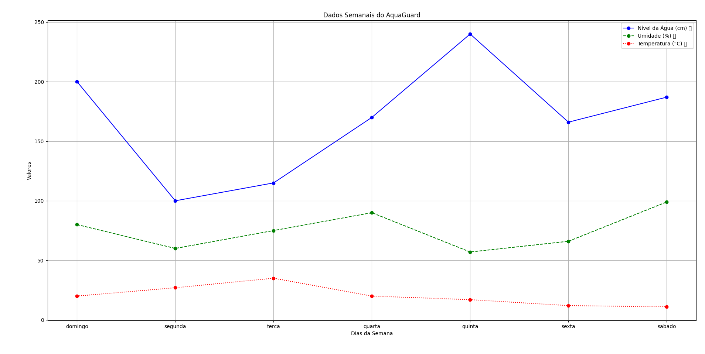

# 🌊 AquaGuard - Seu escudo contra enchentes! 🛡️

> **AquaGuard** é um sistema de prevenção que auxilia civis e funcionários públicos a monitorar o nível da água, umidade e temperatura ao longo da semana, com alertas inteligentes para situações de risco! 🔔

---

## 🚀 Funcionalidades

✅ Cadastro inicial com validação de dados  
✅ Acesso diferenciado para civis e funcionários públicos  
✅ Entrada de dados manuais ou automáticos (simulados de sensores)  
✅ Cálculo de médias semanais 📊  
✅ Alertas inteligentes sobre:
- 🌧️ Possibilidade de chuva
- 🌊 Risco de enchente
- 🌡️ Temperaturas extremas  
✅ Geração de gráfico com visualização clara e colorida  
✅ Mensagem final com opção de comunicação futura

---

## 🧠 Como funciona o código?

### 🔐 Validação

- `validarSenha()`: autenticação para funcionários públicos com 3 tentativas.
- `garanteString()` / `garanteNumero()`: valida entradas como nome, ano, CEP e telefone.

### 📈 Cálculo e Visualização de Dados

- `calcularMedia()` / `media()`: coleta de dados por dia da semana e cálculo de média semanal.
- `gerarGrafico()`: cria um gráfico de linhas com os dados de nível da água, umidade e temperatura.
  


### ⚠️ Alertas Inteligentes

- `alertaMediaAgua()`: alerta baseado na média semanal de nível da água.
- `alertaChuva()`: avalia umidade para prever chuva.
- `alertaMediaTerperatura()`: informa se a semana foi quente ou fria com mensagens humanizadas.

---

## 🧪 Simulação de Cenário

Para **usuários civis**, dados simulados são utilizados:
```python
historicoNvlAgua = [200, 100, 115, 170, 240, 166, 187]
historicoUmidade = [80, 60, 75, 90, 57, 66, 99]
historicoTemperatura = [20, 27, 35, 20, 17, 12, 11]
```
Já funcionários públicos podem inserir dados reais de monitoramento diretamente no sistema.

---

##🖼️ Interface e Experiência

✨ Desde o começo, o sistema interage com o usuário com frases amigáveis e emojis.
✨ Tudo foi pensado para facilitar o uso mesmo para pessoas com pouca familiaridade com tecnologia.

---

##▶️ Vídeo Explicativo

📽️ Assista o vídeo completo com a explicação do projeto e a execução na prática:

👉 [Adicionar link do YouTube]

---

##🤝 Equipe: Aqua Guard

<br /><sub>Gabriel Akira</sub>
Gabriel Akira Borges - RM: 565191

<br /><sub>Gustavo Santos</sub>
Gustavo Francisco Santos - RM: 561820
